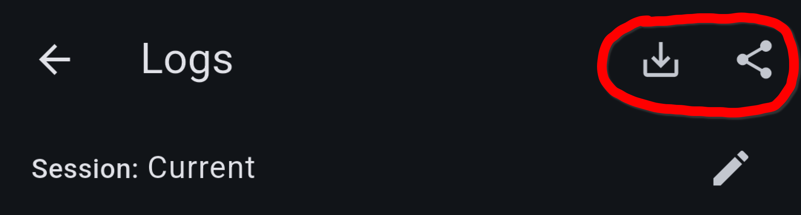

When you [report a bug](https://github.com/juho05/crossonic/issues) you'll often be asked to share your application logs to help with debugging.
This article will explain how you select the right session where your issue actually occurred and how to export its log messages.

You can view your log messages by opening the *Debug* page in *Settings* and clicking on the *View Logs* button.

## Log levels

There are 6 log levels available:

| Level | Description |
| --- | --- |
| `Fatal` | Errors that prevent the application from working as expected. |
| `Error` | General things that went wrong. |
| `Warning` | Something resulted in a sub-optimal situation. |
| `Info` | Important events that happened (e.g. "App started.") |
| `Debug` | Messages that help with debugging. |
| `Trace` | Very verbose logging to help understand the execution of the app better. |

:::caution[Important]
**By default only messages with severity `Info` and up are logged and stored.**

If you change the log level from `Info` to `Debug` you will not be able to see/export debug messages
from before you changed the log level as they were never logged or stored.
:::

Before sharing your logs for an issue, please change the logging level to `Debug` by opening the *Settings* page, navigating to *Debug* and selecting
*Debug* in the *Log level* dropdown. Then reproduce the issue and share the current [session](#session).

## Sessions

Crossonic stores logs for 7 days after which they are automatically deleted. However, by default you only see log messages of events that occurred after the
last application start. Everytime the app is started a new *session* is created. To view logs of past sessions click on the currently selected session
at the top of the *Logs* page. Sessions are named after the time the app was started and contain all messages between the start of the app and the next time
the app was fully closed.

**Make sure that the correct session is selected before exporting/sharing your logs.**

## Export/share

After you reproduced the issue with `Debug` [log level](#log-levels) enabled and you selected the right [session](#sessions), you can export the currently
shown logs by clicking an the *share* or *export* button in the top-right corner of the logs page. Depending on the current platform only one of those buttons
might be available:

- The *export* button (*left in the picture*) allows you to save the logs as a TXT-file.
- The *share* button (*right in the picture*) opens the system share dialog.

When clicking either of those buttons, you'll need to choose between *Save/Share full log* and *Save/Share filtered log*. The first option
includes all available messages of the selected session and the second option only includes the messages currently visible due to the selected
log level filters and search.