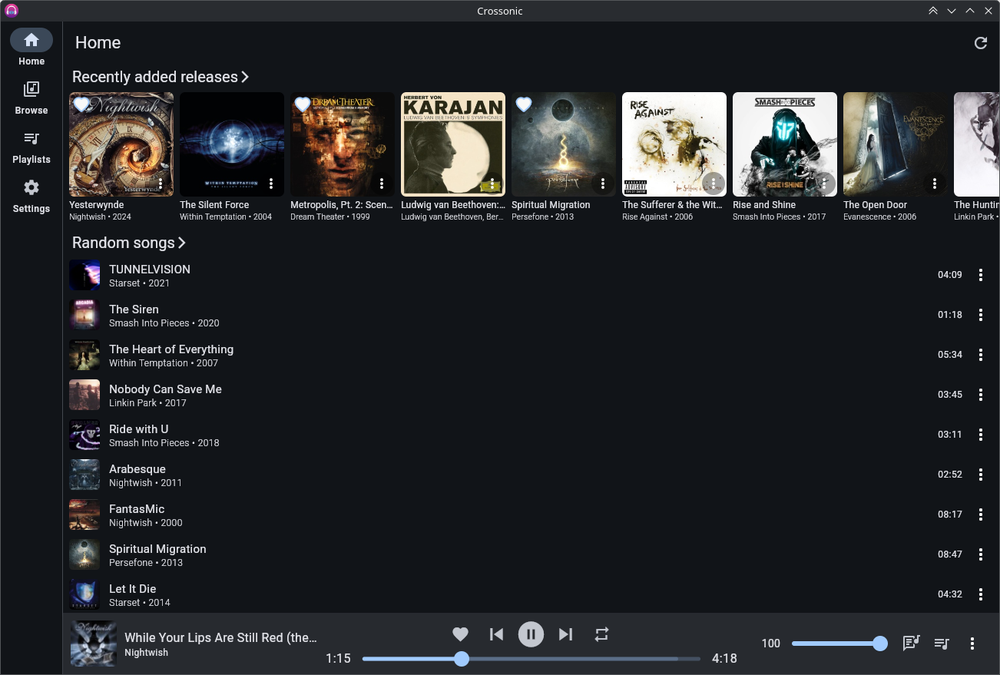
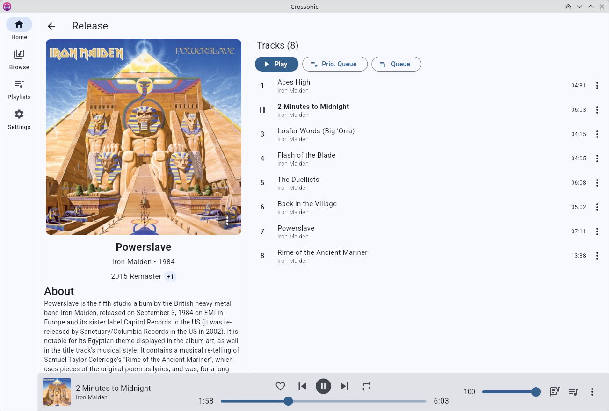
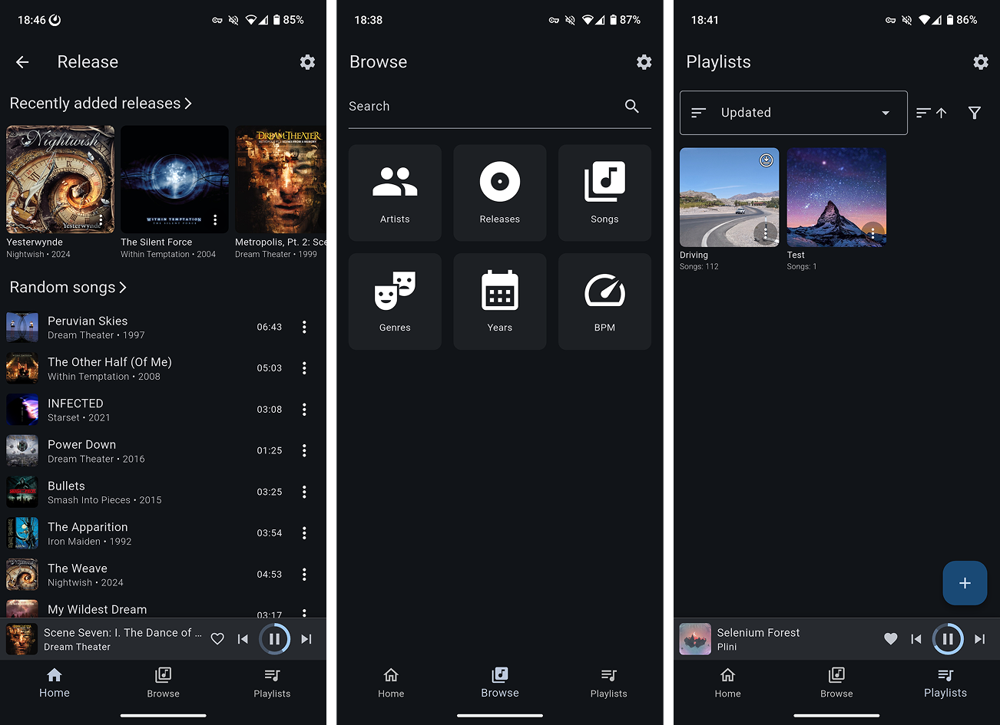
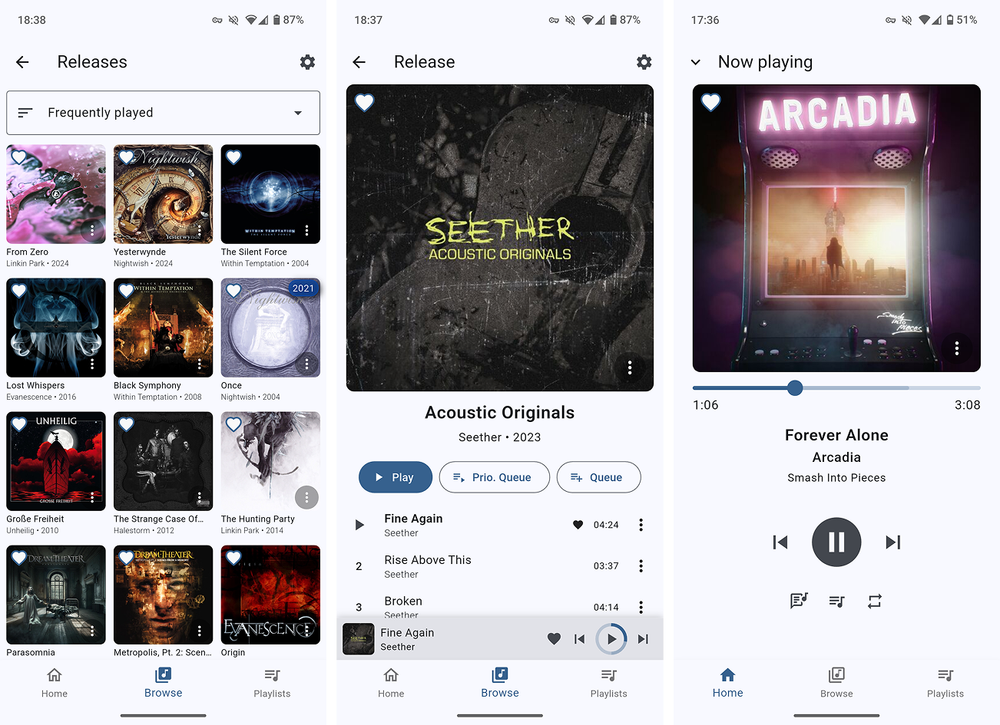
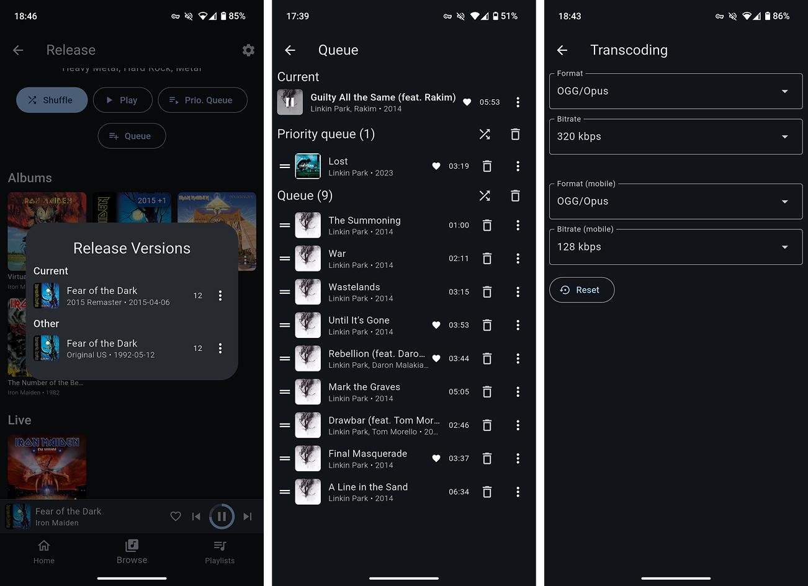

Crossonic is a modern and cross-platform OpenSubsonic compatible music player.

[Screenshots](#screenshots)

[Install](/app/install)

## Features

- [x] Desktop and mobile layout
- [x] Configurable home page
- [x] Respects light/dark theme and accent color
- [x] System integration (*Android media API*, *MPRIS*, *SystemMediaTransportControls*, …)
- [x] Android Auto
  - Currently only playlists
- [x] Close to tray
- [x] Stream original or transcoded media
  - [x] Configurable transcoding settings for WiFi and mobile
- [x] Browse/search songs, albums, artists
- [x] Release types (albums, EPs, singles, live, compilations, …)
- [x] Release versions (*Deluxe*, *Remaster*, *different release years*, *etc.*)
- [x] Favorite songs/albums/artists
- [x] Playlists
  - [x] Download for offline listening
    - [x] Original (*uses [download](https://opensubsonic.netlify.app/docs/endpoints/download/) endpoint*)
    - [ ] Transcoded
  - [x] Add songs/albums/artists
  - [x] Drag&drop reorder
  - [x] Change cover (*crossonic-server only*)
- [x] Configure [ListenBrainz](https://listenbrainz.org) connection (*crossonic-server only*)
- [x] Full [OpenSubsonic](https://opensubsonic.netlify.app/) support (*gracefully handles missing features on the server*)
  - API Key Authentication
  - Transcoded seek
  - Multiple artists/genres/…
  - etc.
- [x] Two queue system
  - Normal queue
    - Automatically populated when listening to an album/artist/playlist
  - Priority queue
    - For songs you want to listen now before continuing with the normal queue
  - Both can be freely modified
- [x] Shuffle artists by song or by album
- [x] Gapless playback
- [x] Lyrics
  - [x] Unsynced
  - [ ] Synced
- [x] Replay gain
- [ ] Load/save queues
- [ ] Internet Radio
- [ ] Pre-cache next x songs for spotty networks
- [ ] Jukebox
- [ ] Remote control other devices running the app
- [ ] End-of-year recap

## Screenshots

## Useful links

- [Installation guide](/app/install)
- [GitHub repository](https://github.com/juho05/crossonic-server)