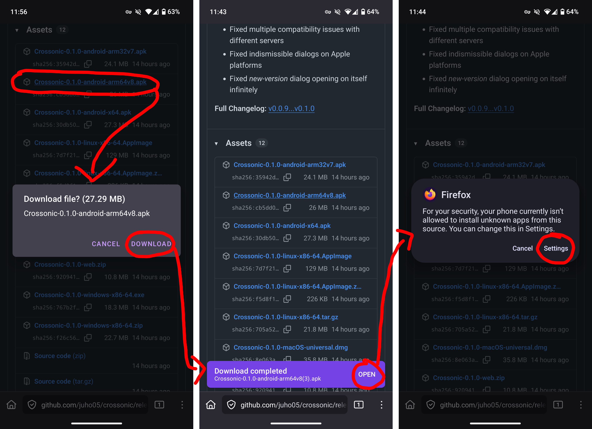
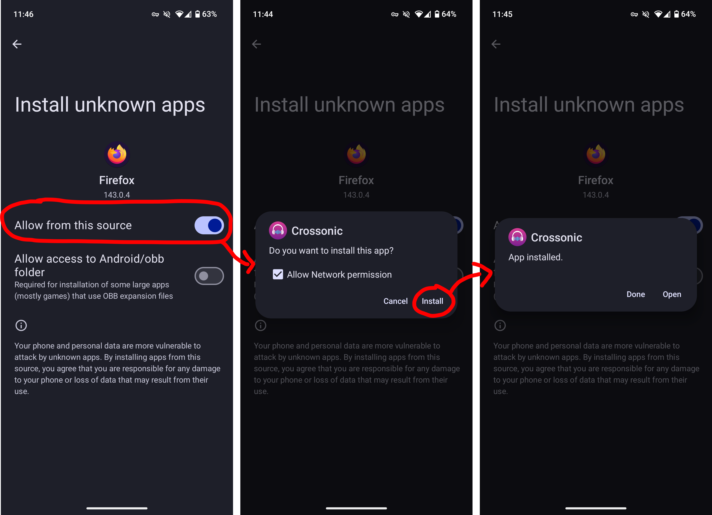
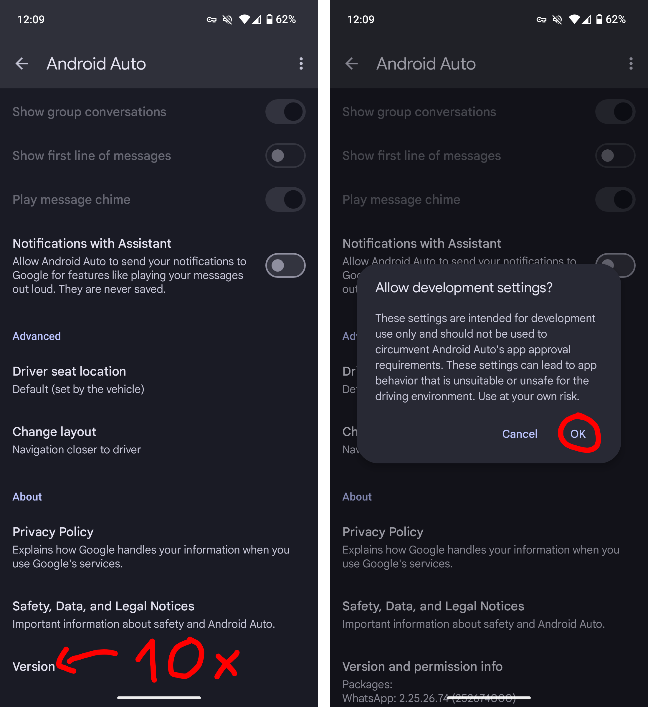
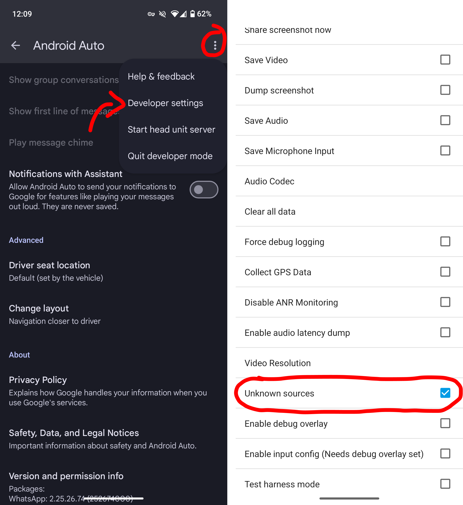

Crossonic is available as an [APK download](https://github.com/juho05/crossonic/releases/latest).

There are three options available:
- `Crossonic-x.x.x-android-arm64v8`
  - This should be the correct choice for most phones. If you are unsure, first try this version.
- `Crossonic-x.x.x-android-arm32v7`
  - Choose this version if you have an old 32-bit ARM device.
- `Crossonic-x.x.x-android-x64`
  - Choose this version if your device uses the `x86_64` architecture (e.g. some Android tablets)

:::note
The APKs are split by architecture to minimize download size.
:::

## Install

If you have installed an APK file before, Crossonic is no different. Though make sure that you follow [Enable Android Auto](#enable-android-auto) if you
want to use *Android Auto*.

The first step is to visit the [releases page](https://github.com/juho05/crossonic/releases/latest), scroll down to *Assets* and download the latest APK file for your architecture.

Now open the downloaded file. You should be prompted to allow your browser/file manager (depending on which app you used to open the APK file) to install
apps from unknown sources. Once allowed you'll be prompted to install Crossonic (if not, you might need to open the APK file again).

If the process looks different on your phone try following the instructions in [this wikihow article](https://www.wikihow.com/Install-APK-Files-on-Android).

## Enable Android Auto

By default *Android Auto* does not allow apps that were not installed from the *Play Store*. This restriction can be disabled using *Android Auto* developer settings.

1. Open *Android Auto* settings (e.g. by searching for `Android Auto` in the settings app)
2. Scroll down to the *About* section of the *Android Auto* settings
3. Tap on *Version* 10 times
4. Click *ok*
5. Tap on the three-dot button in the top-right corner and click on *Developer settings
6. Enable *Unknown sources*

You should now be able to use Crossonic in Android Auto.

## Updating

Starting with version `v0.1.0` Crossonic is able to update itself on Android. Just click *Install* when prompted that a new version is available.

If the update process fails (e.g. on some Xiaomi devices) simply install the latest version as if it were the first installation by following the [installation instructions](#install-apk).

:::tip
When updating for the first time you'll need to allow Crossonic to install apps from unknown sources (similar to how you allowed your browser/file manager to
do the same in the installation process).

To make the first update process easier you may opt to give this permission to Crossonic manually before the first update. The process for doing that
looks different for every system version/manufacturer. Try following [this wikihow article] to allow *Crossonic* to install unknown apps.
:::