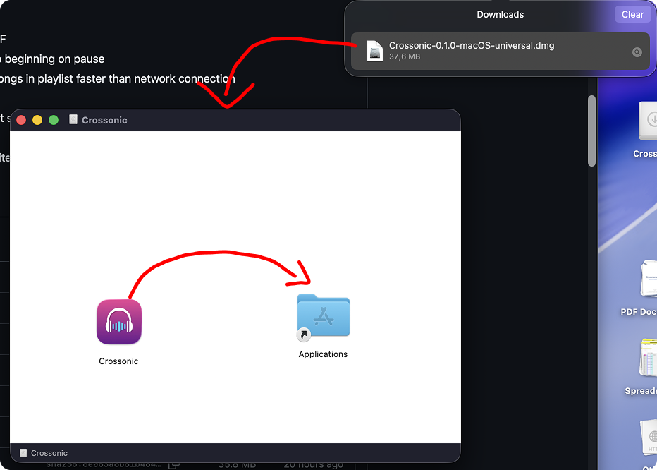
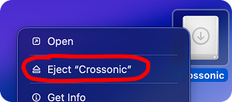
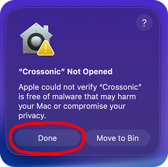
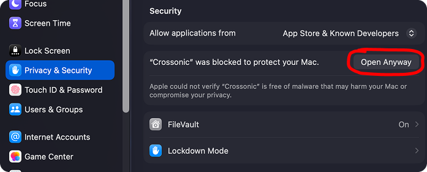
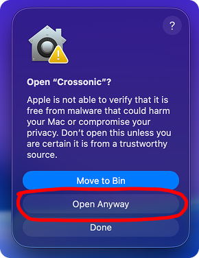
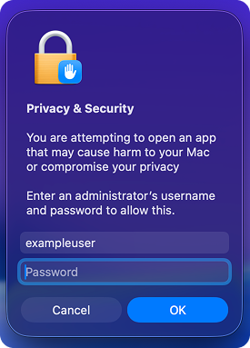

import { Steps } from '@astrojs/starlight/components';

Crossonic is available as a [DMG file](https://github.com/juho05/crossonic/releases/latest) and natively supports both Intel and ARM architectures.

## Install

Visit the [releases](https://github.com/juho05/crossonic/releases/latest) page, scroll down to *Assets* and download `Crossonic-x.x.x-macOS-universal.dmg`.

When you open the file a window with the *Crossonic* icon and the *Applications* directory should appear:



Drag the *Crossonic* icon on top of the *Applications* icon. Crossonic is now installed.

You may now eject the DMG file on your desktop:



### Allowing the app to run

Because the app is not signed, you'll need to manually tell macOS that it's allowed to be executed:

<Steps>
1. Launch *Crossonic* from the application launcher.
2. macOS will tell you, that it blocked the app. Click on *Done*:
    
3. Open the *Settings* app and navigate to the *Privacy & Security* tab.
4. Scroll down until you see: *"Crossonic" was blocked to protect your Mac.*
    
5. Click on *Open anyway*.
6. Now the previous dialog appears again with a new *Open anyway* option:
    
7. When prompted, enter your macOS user password:
    
8. You should now be able to open Crossonic any time you like and this procedure should not be needed in the future.
</Steps>

## Updating

Starting with version `v0.1.0` Crossonic is able to update itself. Simply click *Install* when prompted that a new version is available.
This way Crossonic will automatically overwrite itself with the latest version and allow the new version to be executed (preventing [these steps](#allowing-the-app-to-run) from being needed again).

To manually update Crossonic, fully exit the app then follow the [install instructions](#install) again and confirm to overwrite the existing file when prompted.
When you choose this method of updating you'll need to [allow the new version to run](#allowing-the-app-to-run) again.

## Uninstall

First, fully exit the App.

Then open the *Applications* directory in *Finder* and delete `Crossonic.app` (the file extension might not be visible).

To fully remove any remaining app data, open a terminal and run these commands:

```zsh
rm -r ~/Library/Application\ Support/org.crossonic.app
rm -r ~/Library/Caches/org.crossonic.app
```

Alternatively, manually delete the directories mentioned in the above commands in *Finder* (the `Library` directory is hidden by default).