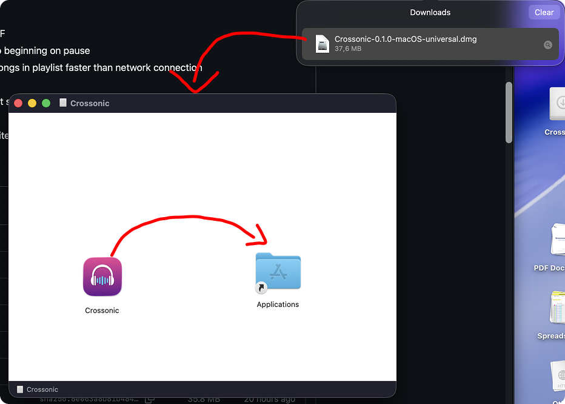
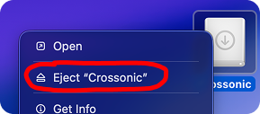

import { Steps } from '@astrojs/starlight/components';

Crossonic is available as a [DMG file](https://github.com/juho05/crossonic/releases/latest) and natively supports both Intel and ARM architectures.

## Install

<Steps>
1. Visit the [releases](https://github.com/juho05/crossonic/releases/latest) page, scroll down to *Assets* and download `Crossonic-x.x.x-macOS-universal.dmg`.
2. When you open the file a window with the *Crossonic* icon and the *Applications* directory will appear:
    
3. Drag the *Crossonic* icon on top of the *Applications* icon.
4. Eject the DMG file:
    
5. Crossonic is now successfully installed on your system.
</Steps>

## Update

Starting with version `v0.1.0` Crossonic is able to update itself. Simply click *Install* when prompted that a new version is available.
This way Crossonic will automatically overwrite itself with the latest version.

To manually update Crossonic, fully exit the app then follow the [install instructions](#install) again and confirm to overwrite the existing file when prompted.

## Uninstall

First, fully exit the App.

Then open the *Applications* directory in *Finder* and delete `Crossonic.app` (the file extension might not be visible).