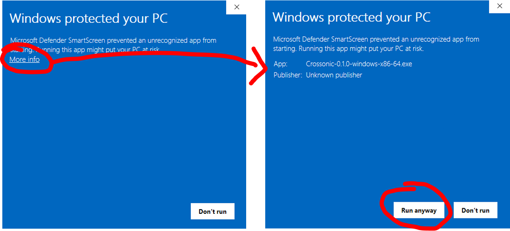
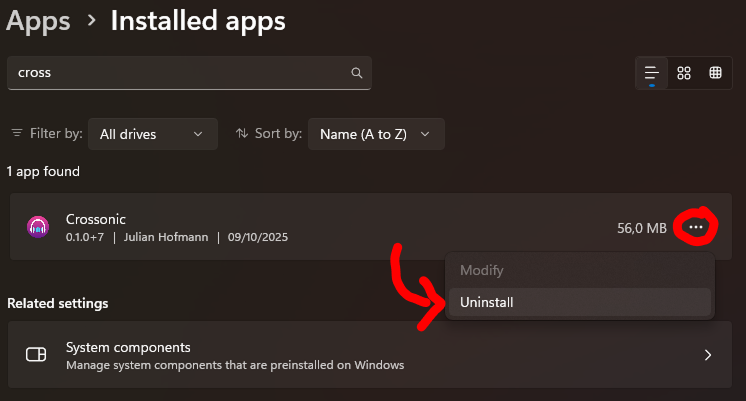

Crossonic offers an [installer file](https://github.com/juho05/crossonic/releases/latest) for Windows.

## Install

Visit the [releases](https://github.com/juho05/crossonic/releases/latest) page, scroll down to *Assets* and download `Crossonic-x.x.x-windows-x86-64.exe`.

Next execute the file you just downloaded. Because the installer is not signed, you might get a warning popup by *Microsoft Defender*:

After that the installer should pop up. Just accept the license and click next until Crossonic is installed.

## Updating

Starting with version `v0.1.0` the app is able to update itself. Simply click *Install* when prompted that a new version is available, then
follow the instructions of the installer.

If you receive a warning popup by *Microsoft Defender* proceed the same way as during the installation.

To manually install a new version first ensure that you fully exited the app by either right-clicking on the tray icon and clicking *Exit*
or by opening the settings page and clicking on *Exit*. Then execute the installer of the new version and it will automatically overwrite
the old version.

## Uninstall

Open the settings app and navigate to *Apps*->*Installed apps*. Search for *Crossonic*, click on the three dots and select *Uninstall*.
Then follow the instructions of the uninstaller.

To fully remove all app data (e.g. downloaded songs, the local database, …), open the file explorer and type `%appdata%` into the address bar.
Then look for a folder named `Julian Hofmann` and delete it.

To remove the cover cache, enter `%localappdata%` into the address bar, look for a folder named `Julian Hofmann` and delete it aswell.