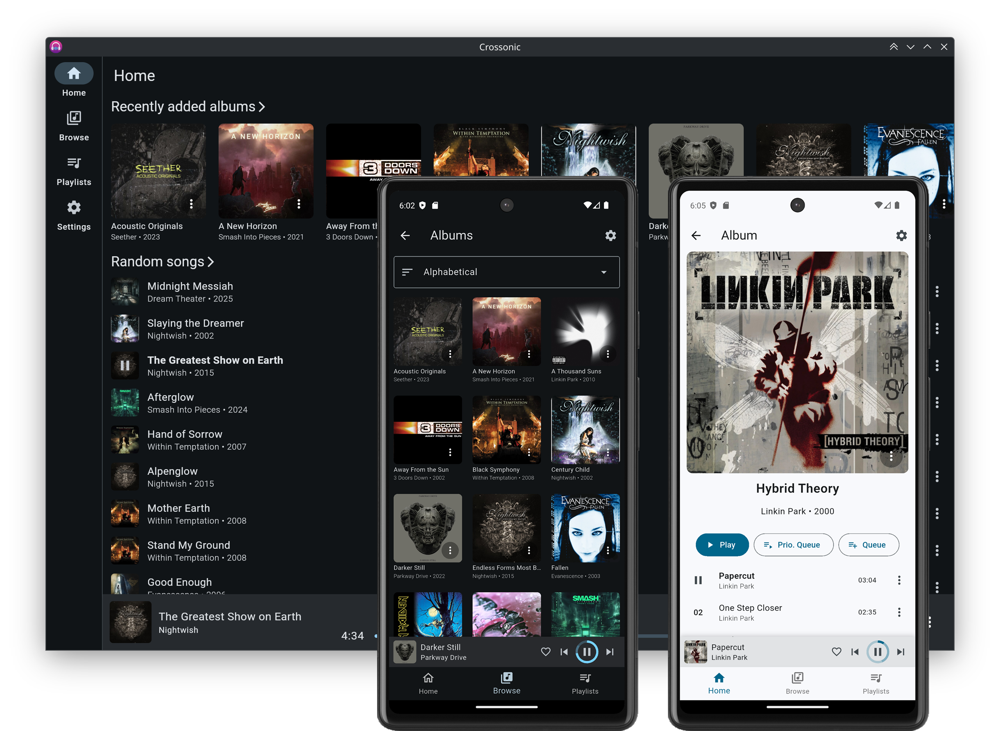
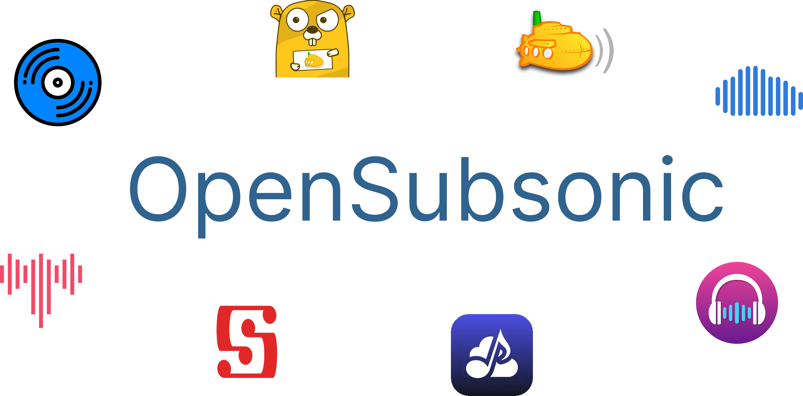
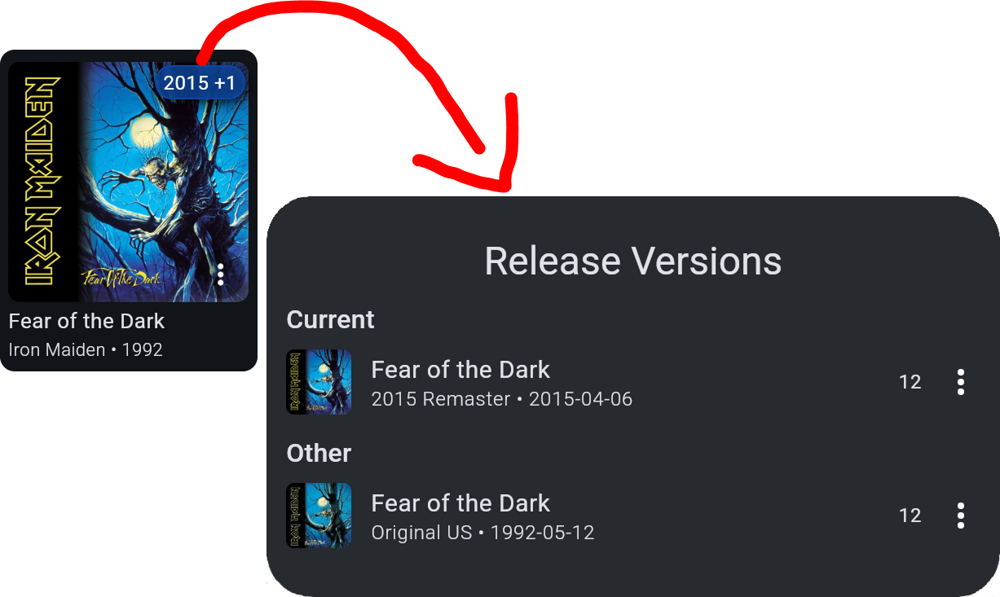

import { Card, CardGrid } from '@astrojs/starlight/components';

<CardGrid stagger>
<Card title="Your media files, everywhere" icon="rocket">

Crossonic lets you stream your personal music library on **Windows**, **macOS**, **Linux**, **Android**, **iOS**[^1] and in your **browser**[^2].

Point [crossonic-server](/server) to your music directory, enter your server URL into [Crossonic](/app) and you are ready to enjoy your music!
</Card>
<Card title="Compatible with OpenSubsonic" icon="approve-check">
The app can use any [(Open)Subsonic](https://opensubsonic.netlify.app/) compatible server as a backend and dynamically
enables/disables features based on availability.

If the app is not available on a platform or if you just prefer a different app you can connect any
(Open)Subsonic compatible client to the server and all of your playlists/hearts/etc. will be synced.

*Some features are only available when using [Crossonic](/app) with [crossonic-server](/server).*
</Card>
<Card title="Transcoding on the fly" icon="cloud-download">
Seamlessly transcode your music on the fly when connected to mobile networks
to reduce data usage.

- Fully supports seeking
- No missing duration etc.
- Wifi vs. mobile settings
- Configurable format/bitrate
</Card>
<Card title="Supports release versions" icon="information">

Crossonic properly handles different release versions (*Deluxe*, *Remastered*, …).
</Card>
<Card title="External integrations" icon="puzzle">
- Scrobble to [ListenBrainz](https://listenbrainz.org)
- Two-way favorites sync with [ListenBrainz](https://listenbrainz.org)
- Fetch artist images from [last.fm](https://last.fm)
- Fetch artist and album descriptions from [last.fm](https://last.fm)
</Card>
<Card title="And much more..." icon="list-format">
- download playlists for offline listening
- replay gain
- Android Auto[^3]
- Browse artists/albums/songs/genres/years/bpm/…
- Configurable home page
- Multiple artists per album/song
- Artist page organized by release types (*album*, *ep*, *live*, *single*, …)
- …
</Card>
<Card title="Open source" icon="github">
Both the app and the server are fully open source under the AGPL-3.0 license:

- [Crossonic repository](https://github.com/juho05/crossonic)
- [crossonic-server repository](https://github.com/juho05/crossonic-server)
</Card>
</CardGrid>

[^1]: There are currently no release builds available for iOS because I do not have a paid Apple Developer account.
[^2]: The web version of Crossonic has some features disabled and generally has poor performance. Browser support varies.
[^3]: Currently only playlists are exposed to Android Auto.