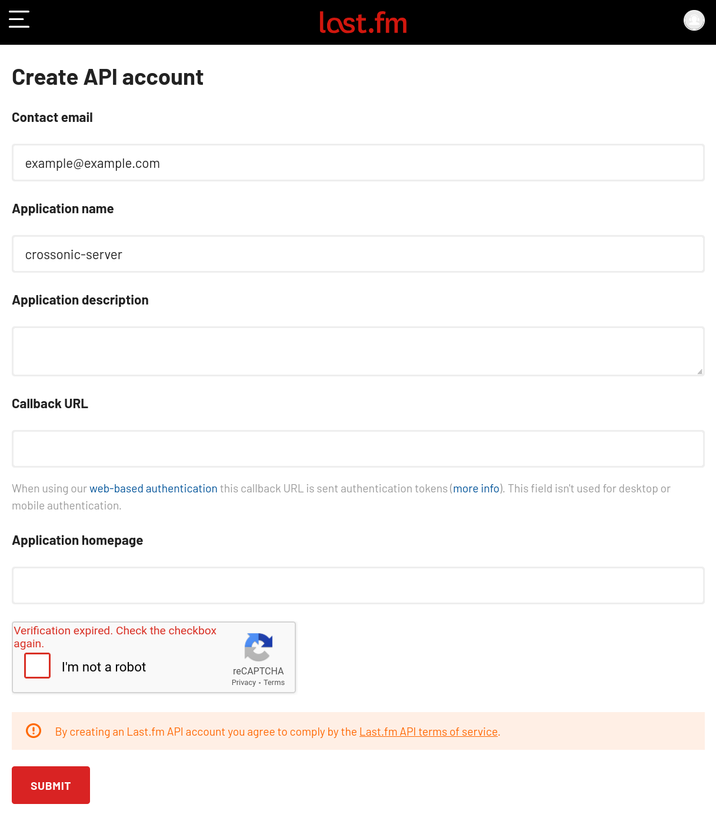
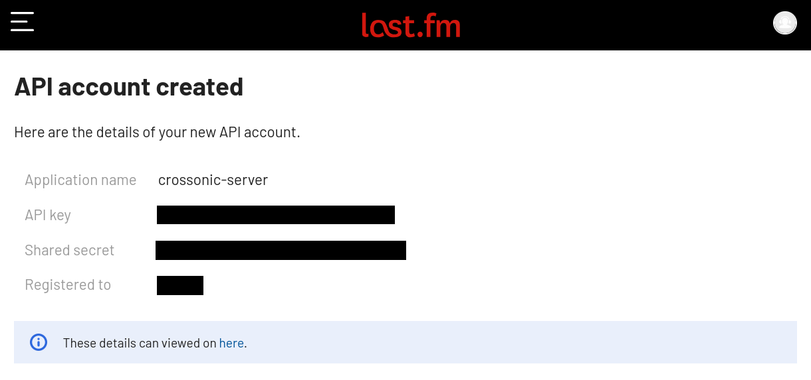

Crossonic-Server supports fetching artist images, artist biographies and album info from [last.fm](https://last.fm). For this to work you'll need to
supply it with a (free of charge) last.fm API key.

To get started visit [this link](https://www.last.fm/api/account/create) and either login to your last.fm account or create a new one. The you should automatically be
redirected a page that looks like this (otherwise just click the link again):



Fill out the displayed form (only *Contact email* and *Application name* are required) and click on *Submit*.

On success you will be redirected to a page showing your created API credentials:



Copy the *API key* and set is as the value of the `LASTFM_API_KEY` environment variable.
Assuming the displayed API key is `x9hp2n6epyaxfnjkgh3jbgjquwwnsh25` you would add the following to your `docker-compose.yml`:

```diff lang="yaml"
# docker-compose.yml
services:
  crossonic:
    # ...
    environment:
      # ...
+      LASTFM_API_KEY: "x9hp2n6epyaxfnjkgh3jbgjquwwnsh25"
    # ...
```

For the configuration to take effect you'll need to restart the container:

```bash
sudo docker compose up -d crossonic
```

Now artist images, artist biographies and album info should be automatically fetched from last.fm when a client requests them.